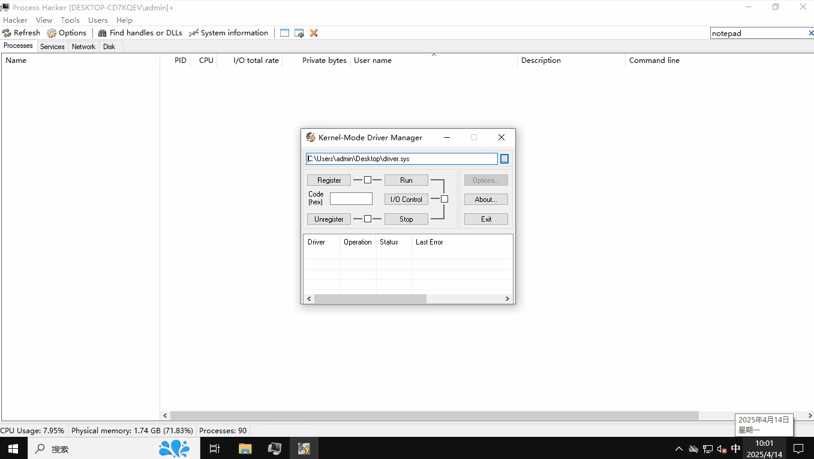
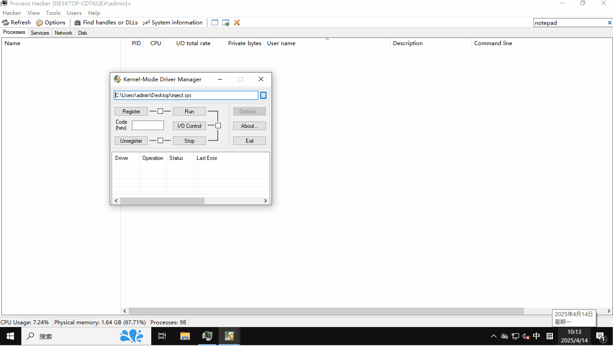

# RMTRD

### 基于 [windows-driver-rs](https://github.com/microsoft/windows-drivers-rs) 实现的内核检测和阻止恶意线程创建在目标进程的项目

## 特点

**检测**
 - 检测用户模式下调用CreateRemoteThread创建起始地址指向kernel32.dll或者kernelbase.dll中的LoadLibraryA(W)的恶意线程。
 - 检测内核模式下调用ZwCreateThreadEx创建的起始地址指向ZwAllocateVirtualMemory申请的野地址恶意线程
 - 检测用户模式和内核模式下起始地址指向指令跳板的恶意线程

**拦截**
 - 拦截恶意线程优雅退出
 - 拦截恶意线程强制退出

> [!提示] 
> 这个驱动项目只是示例了检测和阻止恶意线程的创建在目标进程notepad.exe，使用者可以添加更多的复杂战略规则去过滤需要保护的进程。
> 一些代码引用了工程[BlackBone],并移植到Rust。
参考链接: [BlackBone](https://github.com/DarthTon/Blackbone) 

## 如何验证
### 使用process-hacker
- 编译和启动这个驱动
- 预先准备一个用于注入的DLL包含一些弹窗
- 使用 process-hacker去向目标进程notepad.exe注入一个弹窗的DLL

### 使用另一个驱动用于注入

- 准备用于注入的驱动，在进程创建回调中创建内核模式的远程线程注入
- 准备一个注入DLL
- 编译和启动这个驱动
- 启动notepad.exe检查是否弹窗

## 演示 - 阻止用户模式的远程线程注入

## 演示 - 阻止内核模式的远程线程注入

## 要求

- wdk-sys 0.3.0 or higher
- WDK 10.0.22621.2428 or higher
- Windows SDK 10.0.22621.2428 or higher

> [!要点]
> 项目要求最低基于wdk-sys 0.3.0
> 编译前请按照 [windows-driver-rs](https://github.com/microsoft/windows-drivers-rs) 指示安装

## 许可证
rmtrd is licensed under the MIT License. Dependencies are under their respective licenses.
